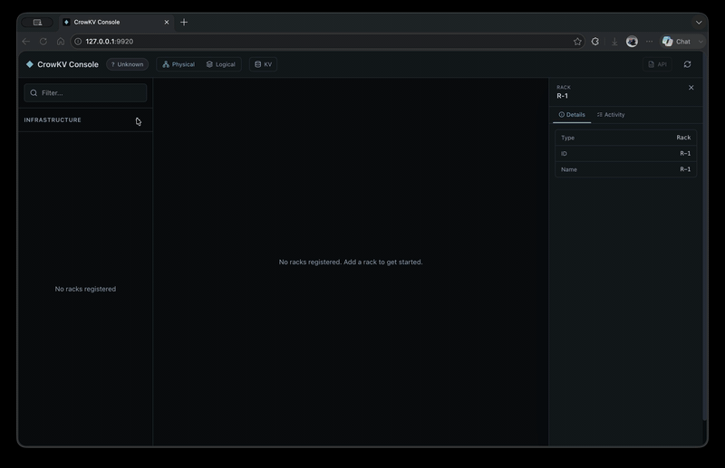
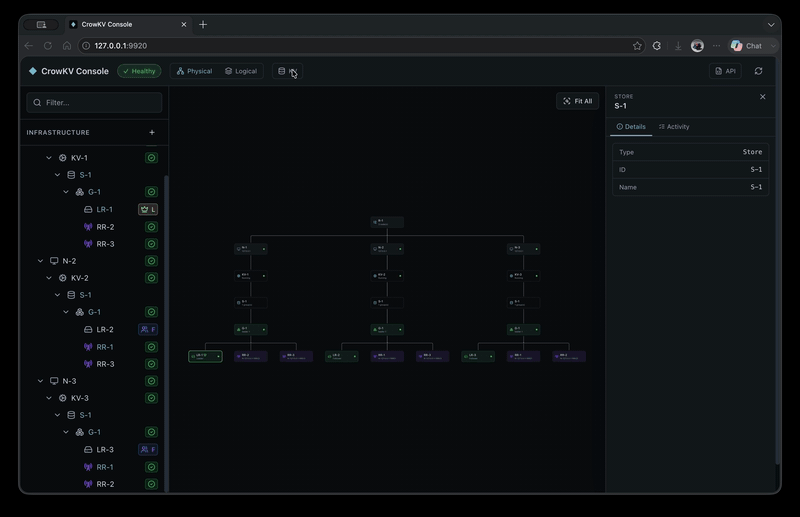

<!-- Copyright 2026-present buzzcrow <buzzcrow@126.com> -->
<!-- Licensed under the Apache License, Version 2.0. -->

# CrowKV

[](https://github.com/buzzcrow/crowkv/actions/workflows/ci.yml)
[](LICENSE)

A distributed key-value engine that takes Multi-Paxos seriously — not as a textbook exercise, but as a deliberate engineering choice to eliminate the sequential commit bottleneck of Raft on the write hot path.

## Why This Project

From past experience building storage systems, a high-performance distributed KV store is the natural foundation layer: putting one underneath a larger storage system greatly simplifies its overall architecture. But that only works with full control over the KV itself — the freedom to make targeted optimizations as workloads demand. Off-the-shelf components don't offer that, so this project builds one from scratch. And since future performance gains are increasingly tied to hardware (io_uring, NVMe, CPU cache behavior), the implementation is Rust + C++, keeping the hot paths close to the metal.

> **Project started July 10, 2026.** Built by a single developer working with AI.

<!-- Demo GIFs — record and replace placeholders -->
<!-- 


-->

## Why Multi-Paxos?

Raft's log is contiguous by construction: a leader cannot acknowledge slot N+1 until slot N is committed. Under high concurrency this becomes a sequential bottleneck.

Multi-Paxos treats each slot as an independent Paxos instance. Slots can be **decided and applied out of order**, turning a sequential wait into a fully pipelined commit path. CrowKV pays for this with extra complexity around gap repair and a slightly more conservative read frontier — a tradeoff documented in detail in the [design doc](doc/design.md#1-design-philosophy).

## Architecture at a Glance

```
                         CrowKV Cluster
  ┌──────────────────────────────────────────────────────────┐
  │   Node A                Node B                Node C     │
  │   ┌─────────┐          ┌─────────┐          ┌─────────┐  │
  │   │Group-1 L│ ◄──────► │Group-1 F│ ◄──────► │Group-1 F│  │
  │   │Group-2 F│          │Group-2 L│          │Group-2 F│  │
  │   └─────────┘          └─────────┘          └─────────┘  │
  └───────▲──────────────────────────────────────────────────┘
          │  HTTP /topology + per-group gRPC reads/writes
     ┌────┴────┐
     │ Client  │
     └─────────┘
```

- **Multi-group sharding** — each node hosts multiple Paxos groups; routing is by explicit `group_id`. Group membership and key ranges are operator-defined.
- **Pluggable storage** — the WAL is the source of truth; the key-value engine is a derived projection. An in-memory engine and `crowtree` (a custom B+tree with delta chains encoding, io_uring async I/O, and epoch-safe lock-free reads) are both implemented behind a unified `KVEngine` trait.
- **Raft where it doesn't matter, Paxos where it does** — leader election, leases, snapshot install, and reconfiguration follow settled Raft designs. Only the write hot path diverges into Multi-Paxos.
- **Console** — a web UI and CLI for cluster lifecycle management (bootstrap, rolling upgrade, replica add/remove, health monitoring).

## Crates

| Crate | What it is |
| --- | --- |
| `crowkv` | Core library: Multi-Paxos consensus, WAL, storage engine trait, RPC, reconfiguration |
| `crowkv-server` | Server binary: hosts groups, serves gRPC + HTTP management API |
| `crowkv-client` | Client library: topology cache, retry, idempotency |
| `crowtree` | Custom storage engine (C++ core + Rust FFI): B+tree, delta chains, io_uring reactor, buffer pool |
| `crowkv-console` | Operations console: web UI (Axum + React) and CLI |

<details>
<summary><b>Getting Started</b></summary>

CrowKV uses [Pixi](https://pixi.sh) for environment management — it pins the C++ toolchain, Rust compiler, and all native dependencies (cmake, gtest, lz4, folly, protobuf, etc.) in a single lockfile. The Linux build targets glibc 2.17 (CentOS 7 / Ubuntu 16.04 era), so binaries built once run on virtually any modern Linux distribution.

```bash
# Install pixi (if not already installed)
curl -fsSL https://pixi.sh/install.sh | sh

# Build everything (crowtree C++ + Rust workspace + web UI)
pixi run build

# Run all tests (C++ ctest + Rust unit/integration + web + Playwright e2e)
pixi run test-suite

# Run a specific test suite
pixi run test-core    # crowkv library
pixi run test-server  # crowkv-server e2e
pixi run test-ct      # crowtree C++

# Lint
pixi run ct-fmt     # C++ format (clang-format)
pixi run ct-lint    # C++ lint
pixi run rs-fmt     # Rust format
pixi run rs-lint    # Rust clippy
```

</details> 

## Documentation

The full design lives in [`doc/`](doc/). Start with:

- [**Design**](doc/design/design.md) — what CrowKV is, why key choices were made, and how the system is structured
- [**User Guide**](doc/user-manual/user-guide.md) — quick start, KV operations, cluster management, and API reference
- [**Doc Index**](doc/doc_index.md) — a navigable map to every design doc and sub-topic

## Notes on AI-Assisted Development

This project was built entirely with AI — every substantive line of code was AI-generated, with human steering and review. I wrote about the experience, what worked, where AI fails, and what it means for the future of software engineering: [**Building Infrastructure Software with AI**](doc/article/ai-assisted-development.md).

## License

See [LICENSE](LICENSE).
