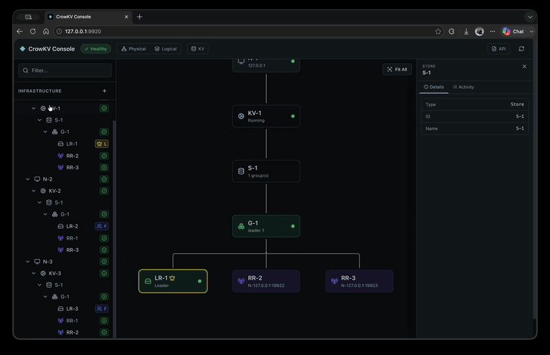

<!-- Copyright 2026-present buzzcrow <buzzcrow@126.com> -->
<!-- Licensed under the Apache License, Version 2.0. -->

# CrowKV

[](https://github.com/buzzcrow/crowkv/actions/workflows/ci.yml)
[](LICENSE)

A distributed key-value engine that takes Multi-Paxos seriously — not as a textbook exercise, but as a deliberate engineering choice to eliminate the sequential commit bottleneck of Raft on the write hot path.

## Why This Project

From past experience building storage systems, a high-performance distributed KV store is the natural foundation layer: putting one underneath a larger storage system greatly simplifies its overall architecture. But that only works with full control over the KV itself — the freedom to make targeted optimizations as workloads demand. Off-the-shelf components don't offer that, so this project builds one from scratch. And since future performance gains are increasingly tied to hardware (io_uring, NVMe, CPU cache behavior), the implementation is Rust + C++, keeping the hot paths close to the metal.

> **Project started July 10, 2026.** Built by a single developer working with AI.

### Demos

**Cluster Lifecycle** — bootstrap a 3-node cluster from scratch: add a rack, register nodes in the physical view, then switch to the logical view to create a store and a Paxos group with replicas on the selected target nodes. The topology canvas updates in real time as replicas come online and elect a leader.


**KV Operations** — the KV Operator panel auto-loads demo keys, then demonstrates put, get, and delete against a specific group. The scan list updates live after each mutation, and demo keys can be bulk-deleted in one click.


**Failover & Replica Management** — add a 4th node and expand the group from 3 to 4 replicas, then remove the leader replica. The remaining nodes re-elect a new leader and KV operations continue uninterrupted. The removed replica is added back afterward. Note: even-numbered replica counts fall back to an odd quorum and function correctly, but odd counts are recommended for production deployments.



## Why Multi-Paxos?

Raft's log is contiguous by construction: a leader cannot acknowledge slot N+1 until slot N is committed. Under high concurrency this becomes a sequential bottleneck.

Multi-Paxos treats each slot as an independent Paxos instance. Slots can be **decided and applied out of order**, turning a sequential wait into a fully pipelined commit path. CrowKV pays for this with extra complexity around gap repair and a slightly more conservative read frontier — a tradeoff documented in detail in the [design doc](doc/design.md#1-design-philosophy).

## Architecture at a Glance

```
                         CrowKV Cluster
  ┌──────────────────────────────────────────────────────────┐
  │   Node A                Node B                Node C     │
  │   ┌─────────┐          ┌─────────┐          ┌─────────┐  │
  │   │Group-1 L│ ◄──────► │Group-1 F│ ◄──────► │Group-1 F│  │
  │   │Group-2 F│          │Group-2 L│          │Group-2 F│  │
  │   └─────────┘          └─────────┘          └─────────┘  │
  └───────▲──────────────────────────────────────────────────┘
          │  HTTP /topology + per-group gRPC reads/writes
     ┌────┴────┐
     │ Client  │
     └─────────┘
```

- **Multi-group sharding** — each node hosts multiple Paxos groups; routing is by explicit `group_id`. Group membership and key ranges are operator-defined.
- **Pluggable storage** — the WAL is the source of truth; the key-value engine is a derived projection. An in-memory engine and `crowtree` (a custom B+tree with delta chains encoding, io_uring async I/O, and epoch-safe lock-free reads) are both implemented behind a unified `KVEngine` trait.
- **Raft where it doesn't matter, Paxos where it does** — leader election, leases, snapshot install, and reconfiguration follow settled Raft designs. Only the write hot path diverges into Multi-Paxos.
- **Console** — a web UI and CLI for cluster lifecycle management (bootstrap, rolling upgrade, replica add/remove, health monitoring).

## Crates

| Crate | What it is |
| --- | --- |
| `crowkv` | Core library: Multi-Paxos consensus, WAL, storage engine trait, RPC, reconfiguration |
| `crowkv-server` | Server binary: hosts groups, serves gRPC + HTTP management API |
| `crowkv-client` | Client library: topology cache, retry, idempotency |
| `crowtree` | Custom storage engine (C++ core + Rust FFI): B+tree, delta chains, io_uring reactor, buffer pool |
| `crowkv-console` | Operations console: web UI (Axum + React) and CLI |

<details>
<summary><b>Getting Started</b></summary>

CrowKV uses [Pixi](https://pixi.sh) for environment management — it pins the C++ toolchain, Rust compiler, and all native dependencies (cmake, gtest, lz4, folly, protobuf, etc.) in a single lockfile. The Linux build targets glibc 2.17 (CentOS 7 / Ubuntu 16.04 era), so binaries built once run on virtually any modern Linux distribution.

```bash
# Install pixi (if not already installed)
curl -fsSL https://pixi.sh/install.sh | sh

# Build everything (crowtree C++ + Rust workspace + web UI)
pixi run build

# Run all tests (C++ ctest + Rust unit/integration + web + Playwright e2e)
pixi run test-suite

# Run a specific test suite
pixi run test-core    # crowkv library
pixi run test-server  # crowkv-server e2e
pixi run test-ct      # crowtree C++

# Lint
pixi run ct-fmt     # C++ format (clang-format)
pixi run ct-lint    # C++ lint
pixi run rs-fmt     # Rust format
pixi run rs-lint    # Rust clippy
```

</details> 

## Documentation

The full design lives in [`doc/`](doc/). Start with:

- [**Design**](doc/design/design.md) — what CrowKV is, why key choices were made, and how the system is structured
- [**User Guide**](doc/user-manual/user-guide.md) — quick start, KV operations, cluster management, and API reference
- [**Doc Index**](doc/doc_index.md) — a navigable map to every design doc and sub-topic

## Notes on AI-Assisted Development

The code in this project was written with AI assistance. But the shape of the software is personal. Architecture, naming, module boundaries, the tradeoffs that matter. Those are human choices. AI is the compiler. The intent is mine.

## Performance

**Write Performance — Inflight Window & Queue Admission** — Multi-Paxos allows slots to be decided out of order, but the leader still needs an admission control window to cap memory pressure from in-flight proposals. CrowKV uses a queue-based admission policy (R18): when the window is full, proposals block on a semaphore instead of being rejected as `Busy`. This eliminates client-side retry storms while maintaining the same peak throughput.

The benchmark below (3-node cluster, in-memory WAL + storage, write-only, 512-byte values, 1M key space, 12-second duration) shows two key results:

- **Window = 1** (effectively Raft-style sequential commit): at 16 concurrent writers, **zero rejections** — the queue absorbs all contention. Throughput is ~13K ops/s (serialized by the 1-permit window).
- **Window = 16** (Paxos pipelined commit): zero rejections, throughput reaches ~37K ops/s — **2.8× faster** than window=1 under the same load.
- **Window = 64, 64 threads** (full pipeline): peak throughput of **50K ops/s** with zero rejections and p99 latency under 2ms.

| Window | Threads | Connections | Throughput (ops/s) | Avg Latency | p99 Latency | Busy Rejections |
| --- | --- | --- | --- | --- | --- | --- |
| 1 | 1 | 1 | 9,074 | 109 µs | 198 µs | 0 |
| 1 | 16 | 4 | 13,278 | 1,203 µs | 1,360 µs | 0 |
| 16 | 1 | 1 | 8,969 | 110 µs | 168 µs | 0 |
| 16 | 16 | 4 | 36,661 | 434 µs | 642 µs | 0 |
| 64 | 64 | 8 | 50,107 | 1,275 µs | 1,942 µs | 0 |

At 1 thread the window size makes no difference (only one proposal in flight at a time). At 16 threads the inflight window is the difference between a serialized bottleneck and a fully pipelined commit path — exactly the architectural advantage Multi-Paxos holds over Raft on the write hot path. Queue-based admission ensures this advantage is realized without any client-side retry logic: **zero `Busy` rejections across all configurations**.

**Read Performance — Two Read Modes** — CrowKV supports two read modes. **Linearizable** reads go to the group leader and wait for a lease barrier (no quorum RPC when the lease is valid — just engine get + gRPC RTT). **MinSlot** reads target any replica with a sufficiently advanced commit slot, distributing load across all replicas in the group.

The benchmark below (3-node cluster, in-memory WAL + storage, read-only, 512-byte values, 200K key space pre-populated, 12-second measurement) was run on a single-node deployment (AMD Ryzen 9 5950X, 16 cores / 32 threads, Linux). Because all three replicas run on one machine, MinSlot's 3-replica parallelism is bounded by the same CPU and gRPC stack as Linearizable — the two modes converge at peak throughput. In a multi-node deployment, MinSlot would scale across separate machines.

| Threads | Connections | Linearizable ops/s | Linearizable p99 | MinSlot ops/s | MinSlot p99 |
| --- | --- | --- | --- | --- | --- |
| 1 | 1 | 5,876 | 233 µs | 5,876 | 233 µs |
| 6 | 6 | 47,366 | 200 µs | 45,563 | 183 µs |
| 24 | 24 | 120,494 | 403 µs | 112,172 | 444 µs |
| 48 | 48 | 144,486 | 828 µs | 135,928 | 884 µs |

Both modes scale cleanly to ~140K ops/s with zero errors. Reads are ~2.8× faster than writes at peak (145K vs 50K) — they skip the consensus critical path entirely (no WAL append, no quorum RPC). The lease barrier costs ~0 when the leader's lease is valid, so a linearizable read is effectively a local engine get plus one gRPC round trip.

**gRPC transport limitation** — the current transport is tonic/gRPC over HTTP/2. HTTP/2's stream multiplexing requires a connection-level userspace lock (HPACK header encoding, frame interleaving, flow-control bookkeeping), which serializes concurrent writers sharing one TCP connection. This costs ~17% throughput when multiple threads share a connection, and causes Linearizable reads to collapse when connections exceed threads (the leader's single endpoint bears all connection-sharing contention). MinSlot mitigates this by spreading connections across replicas. The long-term plan is to replace gRPC on the internal replica-to-replica hot path with a purpose-built Rust RPC library (length-prefixed framing over raw TCP, keeping prost/protobuf for serialization) to eliminate the HTTP/2 connection lock entirely. This is deferred until read throughput becomes the primary bottleneck — currently the bottleneck is consensus (writes) and disk I/O, not read-path framing.

## License

See [LICENSE](LICENSE).
